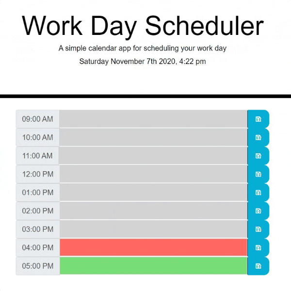

# Day-Planner

## Orlando Baello Homework-5 Work Day Planner

### Links
* [GitHub Repository](https://github.com/baello2020/Day_Planner)
* [Deployed GitHub IO](https://baello2020.github.io/Day_Planner/)

### Summary
* HTML and CSS and Javascript documents create a day planner with an eight-hour work day
* The task saves entries to local storage
* This project highlight the use of Javascript to save data to storage

### Preview

### This project has the following features: 
    * Live local time and date on header
    * A Save button that saves items to local storage
    * Attribute changes for hour by hour time tracking 
    * Gray is past the current hour
    * Red is on the current hour
    * Green is before the current hour
# Acknowledgments

    

